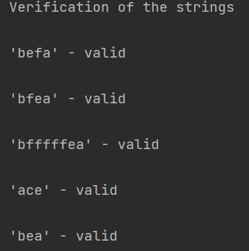

# Topic: Intro to formal languages. Regular grammars. Finite Automata.

## Course: Formal Languages & Finite Automata

## Author: Afteni Maria

# Theory

A language is a set of rules that define the use of a finite, non-empty series of symbols. The rules are interpreted as 
grammar and the symbols used in a language are defined by its alphabet. The Grammar of a programming language consists 
of non-terminal symbols, terminal symbols, production and start symbol. 

Finite automata is the simplest mechanism of recognizing patterns. It consists of the following:

    Q : Finite set of states.

    Σ : set of Input Symbols.

    q : Initial state.

    F : set of Final States.

    δ : Transition Function.

# Objectives 
1. Understand what a language is and what it needs to have in order to be considered a formal one.

2. Provide the initial setup for the evolving project that you will work on during this semester. I said project because usually at lab works, I encourage/impose students to treat all the labs like stages of development of a whole project. Basically you need to do the following:
   
   a. Create a local && remote repository of a VCS hosting service (let us all use GitHub to avoid unnecessary headaches);

   b. Choose a programming language, and my suggestion would be to choose one that supports all the main paradigms;

   c. Create a separate folder where you will be keeping the report. This semester I wish I won't see reports alongside source code files, fingers crossed;

3. According to your variant number (by universal convention it is register ID), get the grammar definition and do the following tasks:

   a. Implement a type/class for your grammar;

   b. Add one function that would generate 5 valid strings from the language expressed by your given grammar;

   c. Implement some functionality that would convert and object of type Grammar to one of type Finite Automaton;

   d. For the Finite Automaton, please add a method that checks if an input string can be obtained via the state transition from it;

# Implementation

Firstly I implemented the grammar as string arrays and used a hash map to bond the non-terminal symbols with the terminal ones 
to create the production. Then I used the generateWords method , where the production is taking place. It verifies if a 
symbol is non-terminal and substitutes it with the terminal symbol from the hash map. After the substitution, the 
resulting string is added to a stack. The process repeats until there are no more non-terminal symbols.    

The resulting strings are displayed as output. 

After the strings are created, the finiteAutomaton method is called, which assets to each transition a key, converting 
it into a Finite Automaton. The transitions are then used to determine if the strings created can be obtained via the 
state transition from the automaton.

# Conclusions

During this laboratory work, I got the chance to implement my theoretic knowledge of language grammar and finite automaton.
Also, in order to finish the laboratory I needed to expend my skills, and I got the opportunity to implement the hash maps for the first time.
Now I am able to implement grammars and to transform them into finite automatons. Overall, I understood that the 
implementation of a language grammar and finite automaton highlights the importance of these tools in formal language theory.