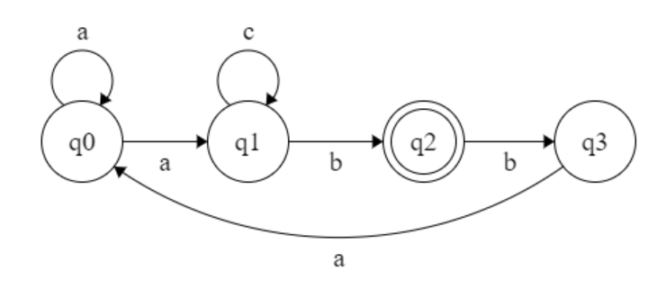

#  Determinism in Finite Automata. Conversion from NDFA 2 DFA. Chomsky Hierarchy.

### Course: Formal Languages & Finite Automata
### Author: Afteni Maria

----

## Theory
Finite automata is the simplest mechanism of recognizing patterns. It consists of the following:

    Q : Finite set of states.

    Σ : set of Input Symbols.

    q : Initial state.

    F : set of Final States.

    δ : Transition Function.
The FA can be classified in 2 types : NFA and DFa. DFA refers to deterministic finite state machines. A finite automaton 
is deterministic if a single result state corresponds to an input symbol and has only one transition.
NFA refers to non-deterministic Finite Automaton. A FA is said to be non-deterministic if there are multiple 
possible transitions from one state on the same input symbol.

## Objectives:
1. Understand what an automaton is and what it can be used for.

2. Continuing the work in the same repository and the same project, the following need to be added:
   a. Provide a function in your grammar type/class that could classify the grammar based on Chomsky hierarchy.

   b. For this you can use the variant from the previous lab.

3. According to your variant number (by universal convention it is register ID), get the finite automaton definition and do the following tasks:

   a. Implement conversion of a finite automaton to a regular grammar.

   b. Determine whether your FA is deterministic or non-deterministic.

   c. Implement some functionality that would convert an NFA to a DFA.

   d. Represent the finite automaton graphically (Optional, and can be considered as a __*bonus point*__):

    - You can use external libraries, tools or APIs to generate the figures/diagrams.

    - Your program needs to gather and send the data about the automaton and the lib/tool/API return the visual representation.

## Implementation description
The `CheckGrammarType` method in the `Grammar` class classifies the given grammar into Chomsky types by calling methods that 
check the type of grammar.

If the grammar has a production of the form A → aB or A → a, where A and B are non-terminal symbols and a is a terminal 
symbol, then it is a Grammar of Type 3.

    public String CheckGrammarType(String[] prodVal, char[] prodKey, String[] prodKey1){

        // Check if the grammar is regular
        if (isRegular(prodVal, prodKey)) {
            return "\nGrammar Type 3: Regular";
        }

        // Check if the grammar is context-free
        if (isContextFree(prodKey)) {
            return "\nGrammar Type 2: Context-free";
        }

        // Check if the grammar is context-sensitive
        if (isContextSensitive(prodKey1)) {
            return "\nGrammar Type 1: Context-sensitive";
        }
      else{
        // The grammar is recursively enumerable by default
        return "\nGrammar Type 0: Recursively enumerable";}
    }

If the production contains a non-terminal symbol that derives one or more non-terminal and terminal symbols, then it is
context-free and the Grammar is of Type 2.

    public boolean isRegular(String[] prodVal, char[] prodKey){
        for ( String val : prodVal ) {
            for (char key : prodKey) {
                if ((val.length() == 1 && Character.isUpperCase(key)) || (val.length() == 2 && 
                        Character.isUpperCase(val.charAt(0)) && Character.isLowerCase(val.charAt(1)))
                        || (val.length() == 2 && Character.isUpperCase(val.charAt(1)) && 
                        Character.isLowerCase(val.charAt(0)))) {
                    return true;
                }
            }
        }
        return false;
    }

If the production is of the form aAb → acb, where A is a non-terminal symbol, a and b are strings of terminals and 
non-terminals, and c is a string of terminals and non-terminals with a length greater than or equal to 1, the Grammar is of Type 1.

    public boolean isContextFree(char[] prodKey) {
        for (char key : prodKey) {
            if (Character.isLowerCase(key)){
                return false;
            }
        }
        return true;
    }

In any other case, the grammar is Recursively enumerable, being of Type 0.

    public boolean isContextSensitive(String[] prodKey1) {
        for (String key : prodKey1) {
            if (key.length() == 1 || key.length() == 2){
                return true;
            }
        }
        return false;
    }

The method `FAtoGrammar` that takes in two arrays of strings (prodKey and prodVal) as parameters and returns an 
ArrayList of strings, converting a finite automaton to a grammar by representing the transitions as production rules.

The method loops through each element in prodKey and prodVal, and constructs a production rule in the form of 
"prodKey[i] -> prodVal[i]". The first production rule is added to the ArrayList `prod` without any modification.

For the production rules that follow, if the key is the same as the previous one, the method adds the value to the end of 
the previous production rule in `prod`. Otherwise, a new production rule is created and added to `prod`.

    public ArrayList<String> FAtoGrammar(String[] prodKey, String[] prodVal) {

        ArrayList<String> prod = new ArrayList<>();

        for(int i = 0; i < prodKey.length; i++) {
            if (i == 0) {
                prod.add(prodKey[i] + " -> " + prodVal[i] );
            }
            else{
                if (!Objects.equals(prodKey[i], prodKey[i - 1] )) {
                    prod.add(prodKey[i] + " -> " + prodVal[i] );
                }
                else{
                    prod.add(  "\r | " + prodVal[i]);
                }
            }
        }
        return prod;
    }
In order to verify if the FA is deterministic or non-deterministic, I created the method `isNFA`, that compares the number of possible
states with the number of elements in the alphabet. If the number of possible states is bigger than the length of the 
alphabet array, the finite automaton is non-deterministic. Otherwise, it is a DFA.

    public void isNFA(String[] states, char[] alphabet){
      if(states.length > alphabet.length){
         System.out.println("Non-deterministic");
      }
      else{
         System.out.println("Deterministic");
      }
    }

In my case, the FA is non-deterministic. The method `NFAtoDFA` converts a non-deterministic finite automaton (NFA) to a 
deterministic finite automaton (DFA). It takes two arrays of strings as input, representing the keys and values of the 
productions in the NFA. It initializes four arrays to store the transitions and states of the DFA. It iterates through 
the productions, splits the value strings, creates new states based on the transitions, and concatenates states when 
necessary. It then adds each transition to the DFA ArrayList and returns it.

      public ArrayList<String> NFAToDFA(String[] prodKey, String[] prodVal){
      ArrayList<String> DFA = new ArrayList<>(); // Create list that will contain final DFA transitions
      String[] Q = new String[20];  // Create string array of the DFA states
      String[] trans = new String[20] ; //Create an array that will store the transition value
      String[] newState = new String[20]; //Create an array to store the new states
      String[] Split;

        for(int i = 0; i < prodKey.length; i++){
            String val = prodVal[i];
            Split = (val.split("q", 0));
            trans[i] = Split[0];
            newState[i] = Arrays.toString(new String[]{"q" + Split[1]});
            if (i != 0) {
                if (prodKey[i].equals(prodKey[i-1]) && trans[i].equals(trans[i - 1])) {
                    newState[i] = newState[i - 1] + newState[i];
                    newState[i-1] = newState[i];
                }
                Q[i] = newState[i - 1];

            }
            else {
                Q[i] = newState[i];
            }
            DFA.add(("(" + Q[i] + "," + trans[i] + ")" + "=" + newState[i]));
            }

        return DFA;
    }
   

## Conclusions / Screenshots / Results
After execution, the output of the program is:

      Grammar Type 3: Regular
      
      Production of converted FA to grammar:
      P = {
      q0 -> aq0
      | aq1
      q1 -> cq1
      | bq2
      q2 -> bq3
      q3 -> aq1
      }
      
      Finite Automata Type:
      Non-deterministic
      
      Production of converted NFA to DFA:
      P = {
      ([q0],a)=[q0]
      ([q0][q1],a)=[q0][q1]
      ([q0][q1],c)=[q1]
      ([q1],b)=[q2]
      ([q2],b)=[q3]
      ([q3],a)=[q1]
      }

Graphical representation of NFA

During this laboratory work, I understood better the Chomsky hierarchy and the difference between DFA and NFA. 
Creating a method that converts a non-deterministic FA to a deterministic one, helped me to comprehend the process of 
how it is done, not only theoretically, but, also practically. 

